# 小优妮的文明6模组笔记

## 11 音频

最后一座大山了。是否有些激动呢？但前途还依然漫长！

在开始之前，你需要准备好你将要放入游戏的音频。当然，如果你还没有找到趁手的BGM和台词，我们也准备了几段以便教学。其中，语音的名字最好更加统一一点，因为我们将来还会用到它。

>**最佳实践**：音频文件预处理
>
>远古时代的背景音乐文件宜将响度均衡至-28LUFS（非主题音乐的背景音乐即便进入下一个时代也保持这个音量，无需在之后的时代中提高），之后时代的则均衡至-25LUFS。语音文件的响度则大约是-21LUFS。无论使用WWise的音量调节还是自行编辑音频文件，都应该调整到大约这个大小。配置中，我们还会另外为这些音频调整音量，例如外交背景的音乐比常规游戏时小8dB。音频格式应当是48000Hz采样率的无压缩WAV文件，音乐为立体声，语音为单声道。

>**笔记笔记**：深入探索
>
>解析游戏的音频使用方式需要付出相当大的努力。本教程仅提供了制作一个领袖和文明需要的背景音乐和无本地化语音。要进一步探索游戏中的音频如何工作，你需要对游戏的WWise声音库进行逆向工程的软件。笔者使用的是WWiser，可以在GitHub中找到它的代码储库。
>
>如果你选择自己建立声音库而不是使用笔者提供的模板，则需要在WWise的项目（Project）菜单中找到项目设置（Project Settings），然后转到声音库（SoundBanks）选项卡。
>
>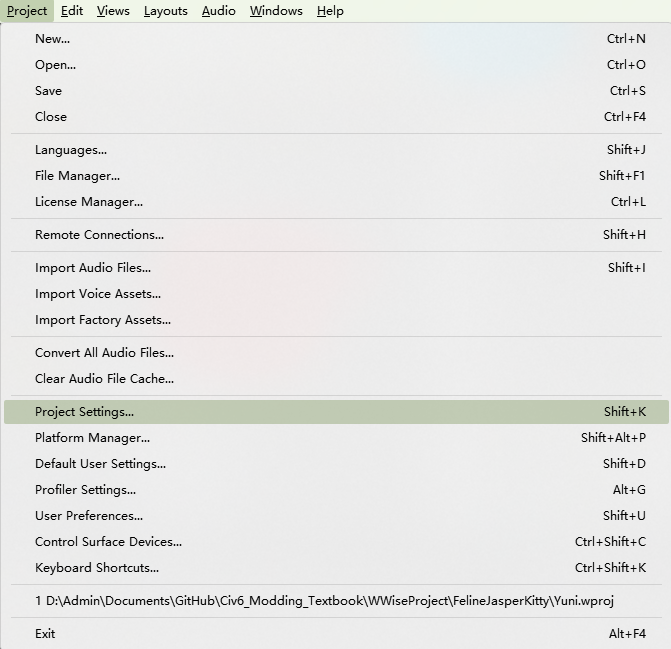
>
>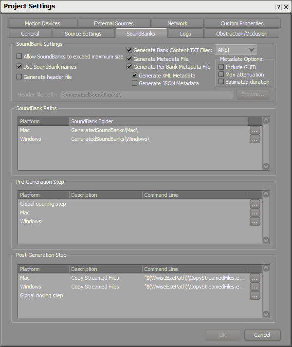
>
>按以上内容配置勾选。这样，我们才能在生成声音库文件的时候获得我们需要放入模组中的全部内容。

将素材文件夹中`WWiseProject`复制一份，文件夹改名为你的模组工程的名字，然后使用WWise打开它。当你打开模板工程的时候，你看到的将是这样一个结构：

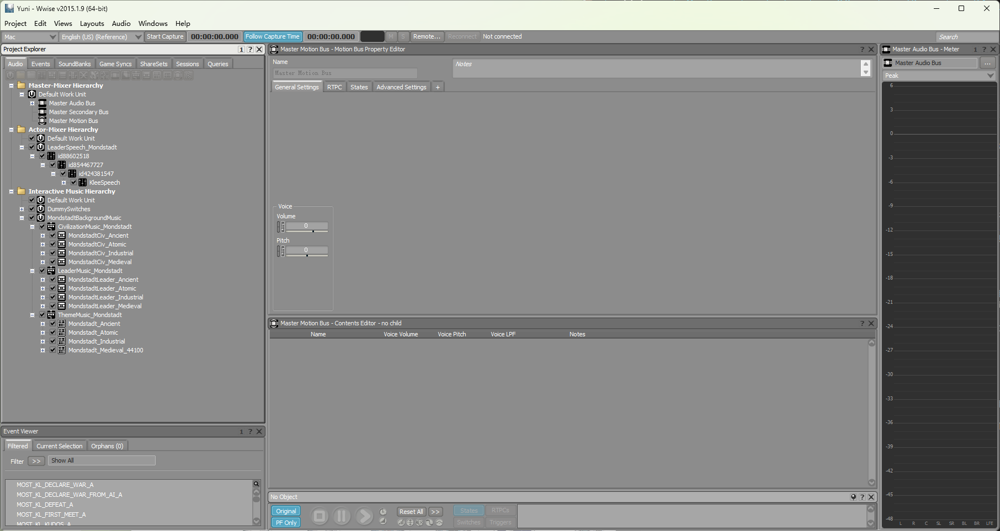

该模板使用了一些非常规手段制作，因此作为新手，你不需要理解它是如何做到的，也先不要试图自己还原这个架构。

>**小道消息**：刺入音频引擎
>
>模板工程中存在大量名称形如id88602518一样的项目，这些项目的内部id被手动调整，以适配文明6游戏的音频系统。如果你有兴趣，可以进一步使用文本编辑器打开工程文件进行解析。如你所见，分发给大家的这份模板是基于笔者的“提瓦特的日月包”制作的。看到这里请给我的作品一个好评，它承受过太多不该有的恶意！

我们要做的是，将它已经做了的东西，复制一份。选择`LeaderSpeech_Mondstadt`，将其后缀改名为我们的文明名称，此处是`LeaderSpeech_Feline`。千万，千万不要触碰任何名字带有id的一切。

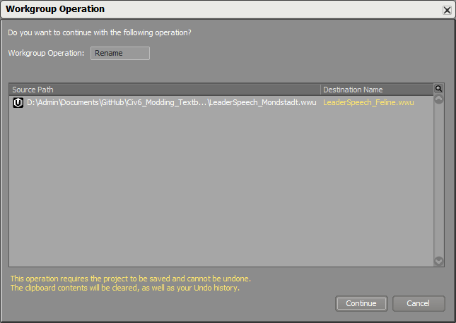

弹出的提示框会警告你，如此做将导致已做出的修改无法撤销。

对于id层以下的KleeSpeech，则需要原地复制一份。选择KleeSpeech，然后在id424381547处粘贴。这个id可能代表了领袖语音，至少所有的领袖语音都在这个项目中。完成后你会获得KleeSpeech_01，将其前缀改名为领袖——`JasperKittySpeech`。保存，然后删除原来的KleeSpeech，再保存。务必要遵循这个动作顺序！

>**笔记笔记**：保存，再保存
>
>复制再保存是为了让WWise为新的领袖音频设置新的内部ID，这样它才不会和已做过的模组冲突。

右键单击`JasperKittySpeech`，选择“导入音频文件…”（Import Audio Files...），然后将我们准备好的语音导入。其下现有的语音未在本模板中提供，可以被删掉。

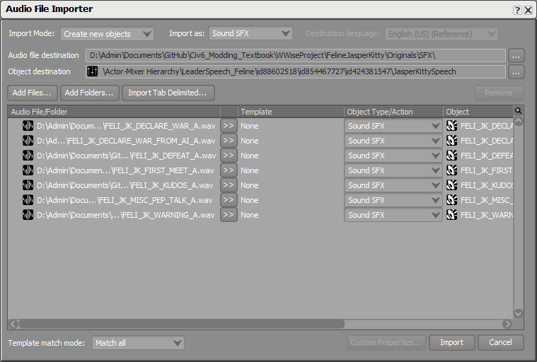

选择导入（Import）即可。

然后，在左下角的事件浏览器（Event Viewer）中，你将能够找到7个被标记为丢失的事件。这些都是刚才被我们删除了音频的事件。我们需要做的是先把这些事件改名为与我们放入的语音同名，然后使其播放我们需要的声音。办法很简单，选中一个事件，在右上角的事件编辑器中编辑名称（Name）。

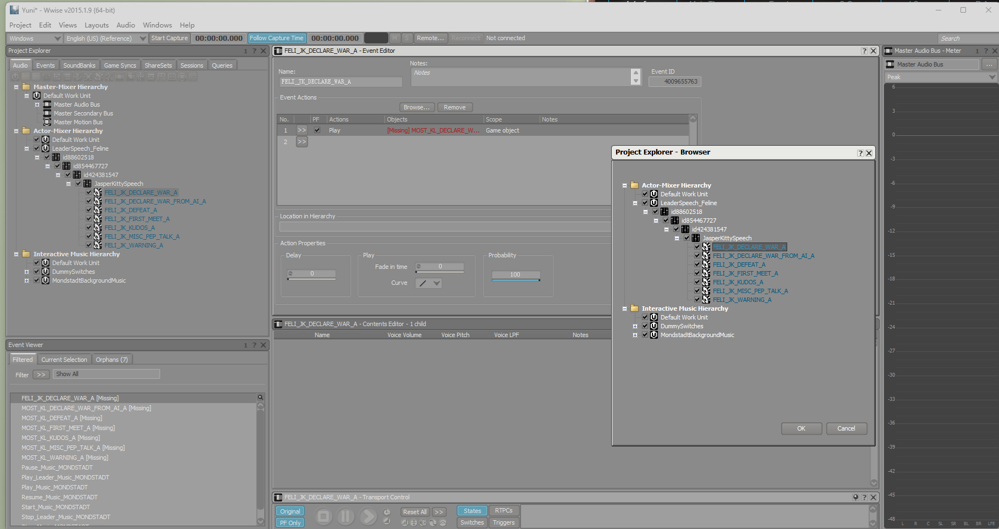

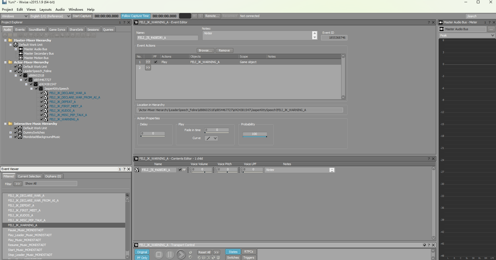

音乐的部分要更加难一些。首先，文明的音乐被分为三组：加入轮播的背景音乐；外交背景音乐；以及主题音乐，每次载入游戏都会先播放当前时代的主题音乐。和刚才一样，我们改名`MondstadtBackgroundMusic`并原地复制其下的三个项目，然后从最复杂的第一项开始。

同样将每个时代的MondstadtCiv改名为你需要的文明的名称，然后删除其下的所有现有条目。接着，导入音频文件。具体如下：

Ancient：导入远古时代主题曲和所有轮播音乐。

Medieval：导入中古时代主题曲、远古时代主题曲和一半（取你更喜欢的一半即可）的轮播音乐。

Industrial：导入工业时代主题曲、中古时代主题曲。

Atomic：导入原子时代主题曲、工业时代主题曲。

方便起见，这里我们准备了三段背景音乐音频，而没有准备完整的音乐组合。其中，主题曲被复制为4份并分别调好音量。

>**小心脚下**：增加更多时代？
>
>文明6的游戏音频引擎不会向游戏发送远古、中古、工业、原子以外的其它时代信息。除非重写游戏引擎，否则在WWise中增设时代点的想法都将失败。WWise的游戏同步（Game Syncs）信息实际上保存在生成的`Init.bnk`中，而一旦你胡乱制作并导入了一个`Init.bnk`，整个游戏的音频都会失效。不要尝试轻易改动它， 在需要引用官方游戏同步开关时，请确保自行编写的开关参数和官方的一致。

重复的音频我们先不添加，因为过会儿我们要复制其它配置。完成后，这一步看起来像这样。

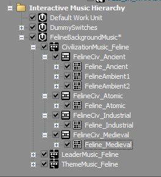

导入完成后，我们进入被导入的声音片段，勾选流式传输（Stream）（只有音乐要如此做，语音不要）。其他设置不变。

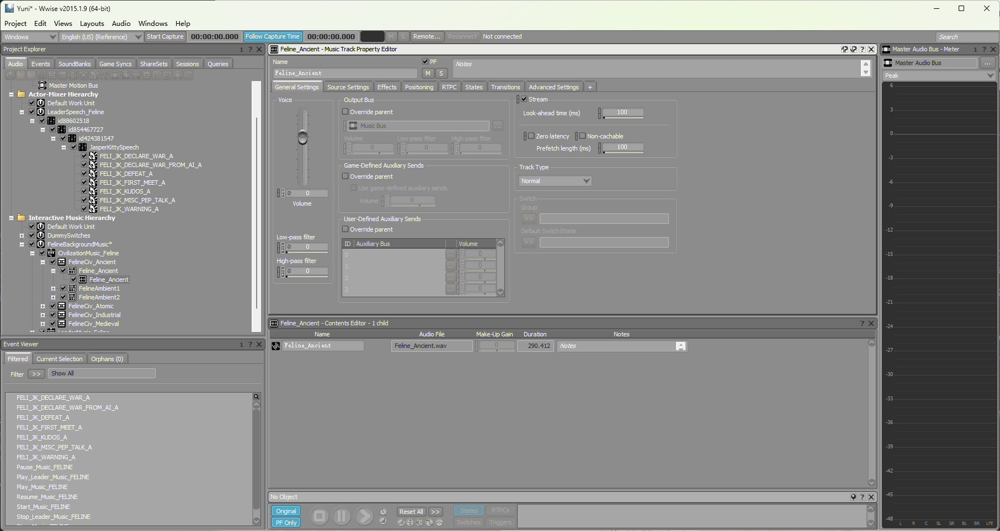

然后我们选择菜单栏的“布局”-“交互音乐”（Layouts-Interactive Music，快捷键F10），打开新的面板。选择我们导入的音乐，界面会变成这样：

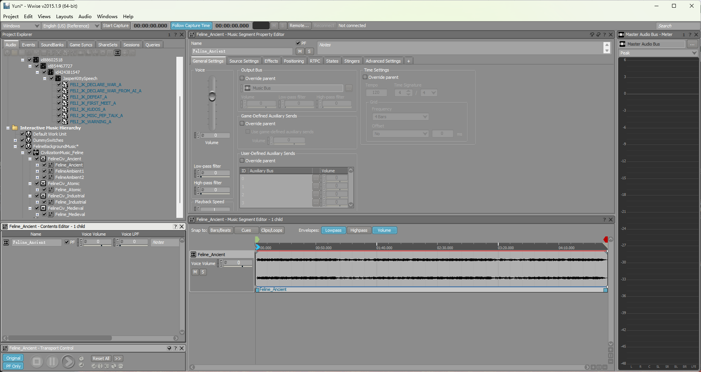

右下部分是一个时间轴，我们右键点击上面时间的部分，并选择“新建自定义时间戳”（Add Custom Cue）。

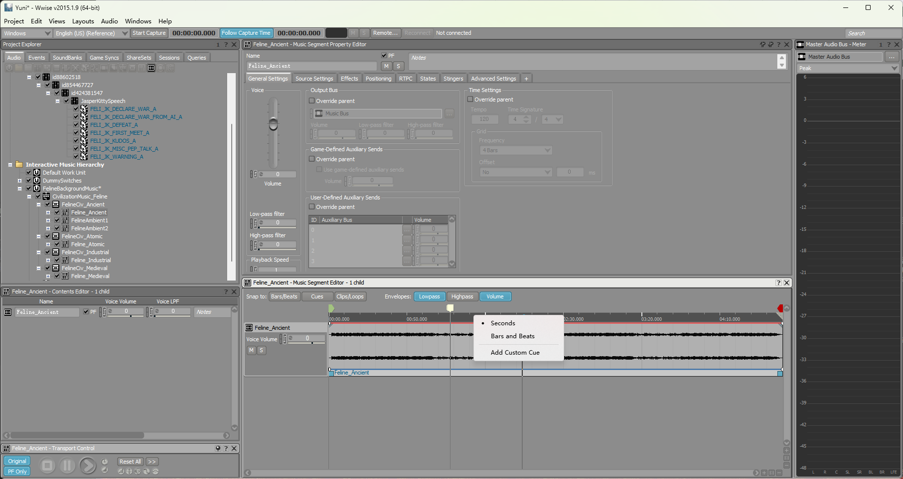

完成后，时间轴中会多出一个白色的光标。

双击它，然后填入它的名字：ExitCustom。（一个字都不能错！）拖动它到微微前于于红色中止光标的位置（越接近越好。保险起见，你可以在音频尾部增加一点无声的时间，以免音乐突然停止）。

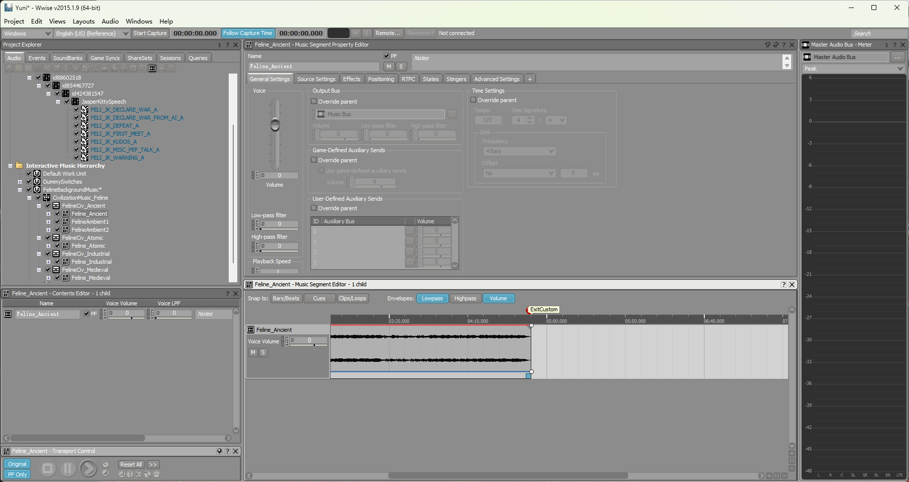

这样才算是正确导入了一段音乐。没有设置ExitCustom会导致你的音乐播完后，游戏不再播放任何音乐。对所有其它导入的音乐照做。

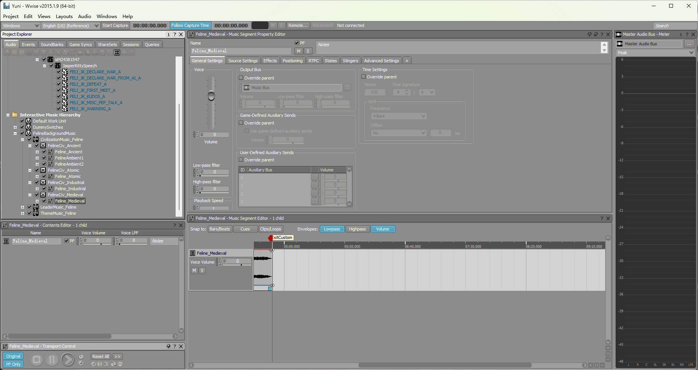

然后，将这些导入的音乐复制向它该去的所有地方，也包括领袖音乐和主题音乐。注意领袖外交背景音乐需要对MondstadtLeader改名，主题音乐少一层音乐播放列表容器（Music Playlist Container），以及这两者每个时代节点都只有一曲主题曲。完成后，类似于这样：

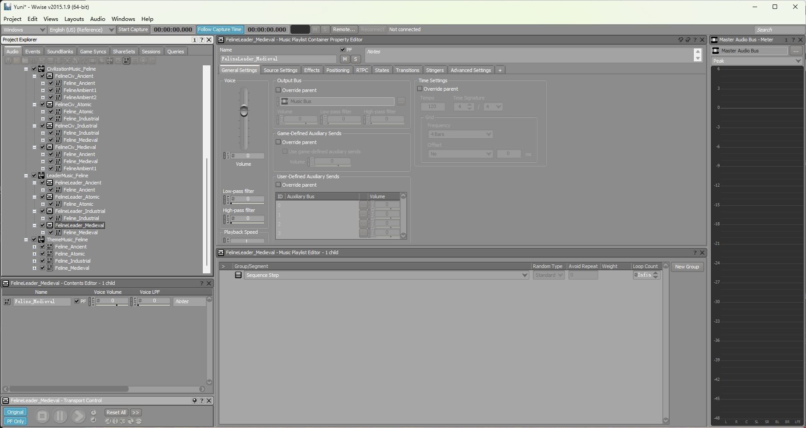

下一步，配置主题曲所属的时代以及每个时代的音乐选曲权重。点击ThemeMusic_Feline，在右下角的时代配置中重新配置每个时代的主题音乐。

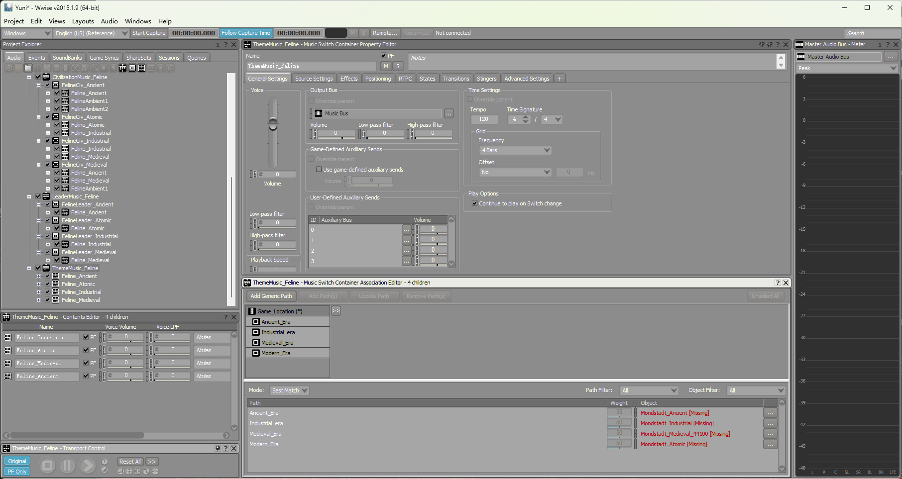

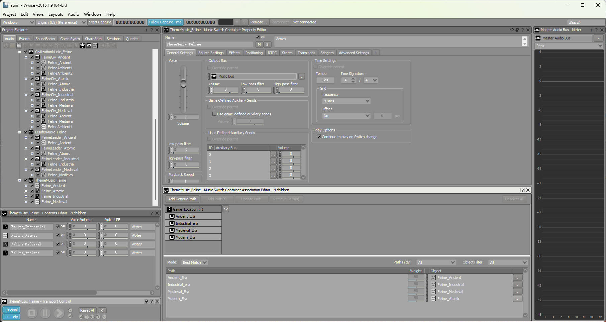

切换到CivilizationMusic_Feline下的FelineCiv_Ancient。拖动框选（不要一个一个点，否则界面会跳走）其下的所有音乐并将其拖动到右下角的列表中。

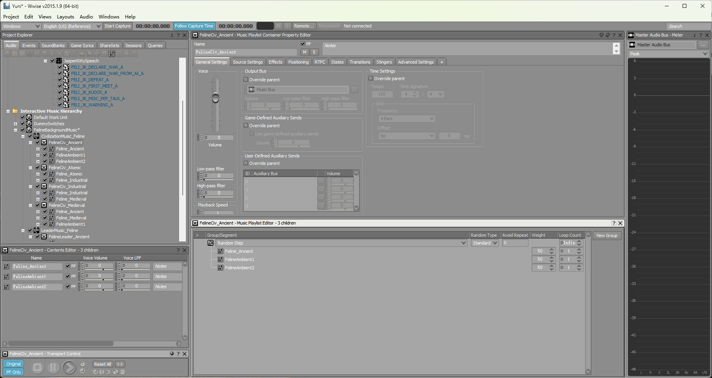

然后配置每段音乐的权重（Weight）。方法如下：

Ancient：所有音乐都相同，默认50。

Medieval：中古时代主题曲为50，其它所有音乐平分剩下的50。

Industrial：工业时代主题曲为60，中古时代主题曲为40。

Atomic：原子时代主题曲为60，工业时代主题曲为40。

以上方法可以确保文明音乐的播放方式和原版文明相同。如果你有其它主意，当然也可以自己配置。

领袖外交界面音乐，各自只有一曲主题曲，直接拖入即可。

选择菜单栏的“布局”-“设计器”（Layouts-Designer，快捷键F5），继续检查事件查看器。

同样采取原地复制、保存、删除旧项（快捷键可能不能用，要小心）的方式，重新生成一遍所有的事件，并将所有MONDSTADT改名为你的文明的内部变量名（不含CIVILIZATION_），本例中是FELINE。

然后将所有标红的动作替换为对应的你新设置的对象（例如，CivilizationMusic_Mondstadt改为CivilizationMusic_Feline）。

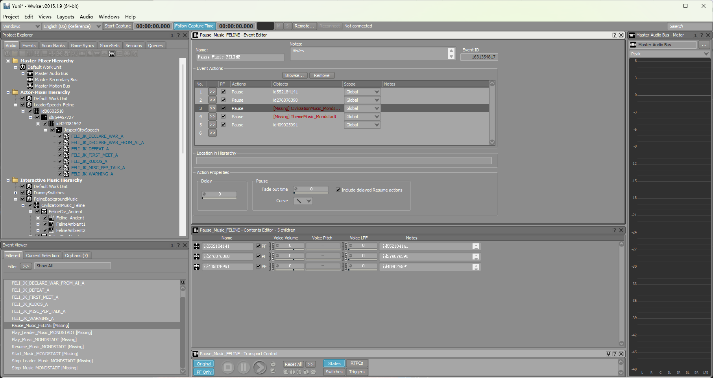

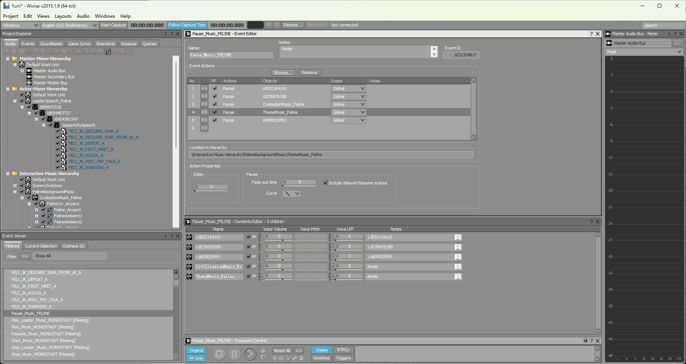

千万不要动任何id字样的东西！

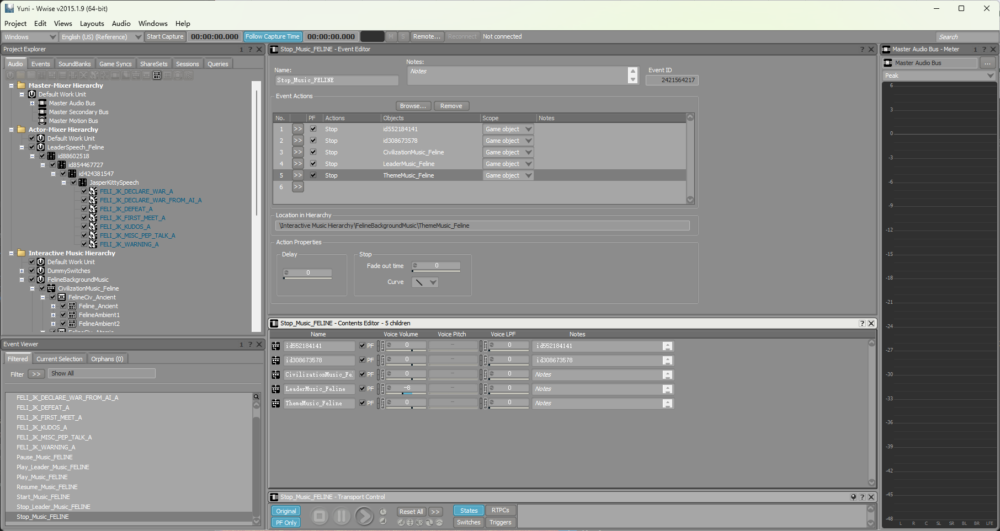

完成后效果如上。

选择菜单栏的“布局”-“声音库”（Layouts-SoundBanks，快捷键F7）。

点击Mondstadt_Music_Bank，在屏幕下方的声音库编辑器中修改它的名字（例如，Feline_JasperKitty_Music_Bank），按Del键删掉标红的项目（如果此时不是只有1项是标红的，说明前面有项目未做好防冲突，应当检查），并从左上角把CivilizationMusic_Feline、LeaderMusic_Feline、ThemeMusic_Feline拖入。左下角把音乐事件拖入。

对Speech，改名后，删掉KleeSpeech和标红的所有事件（如果此时所有项不是都标红的，说明前面有项目未做好防冲突，应当检查），从左上角把JasperKittySpeech拖入，左下角把所有的语音事件拖入。

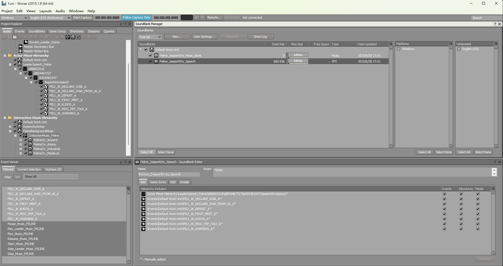

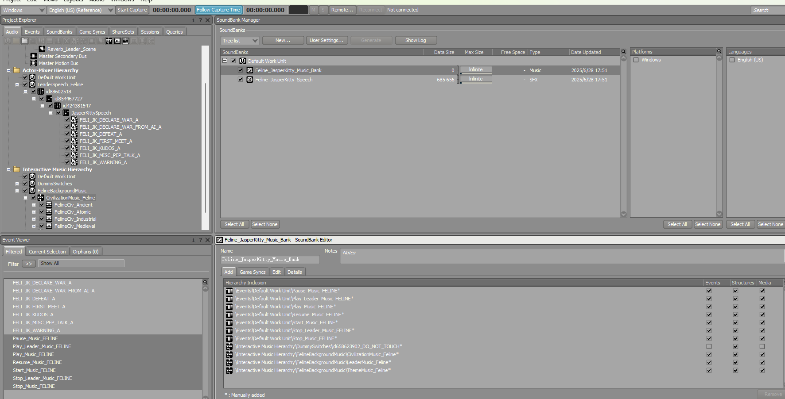

分别右键单击并选择“为当前平台生成声音库”（Generate SoundBank(s) for current platform，快捷键Shift+F7）。

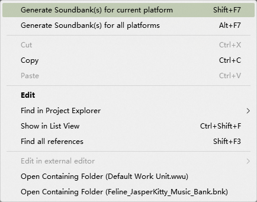

这样，我们在WWise工程文件夹的`GeneratedSoundBanks\Windows`下就会获得一群文件。

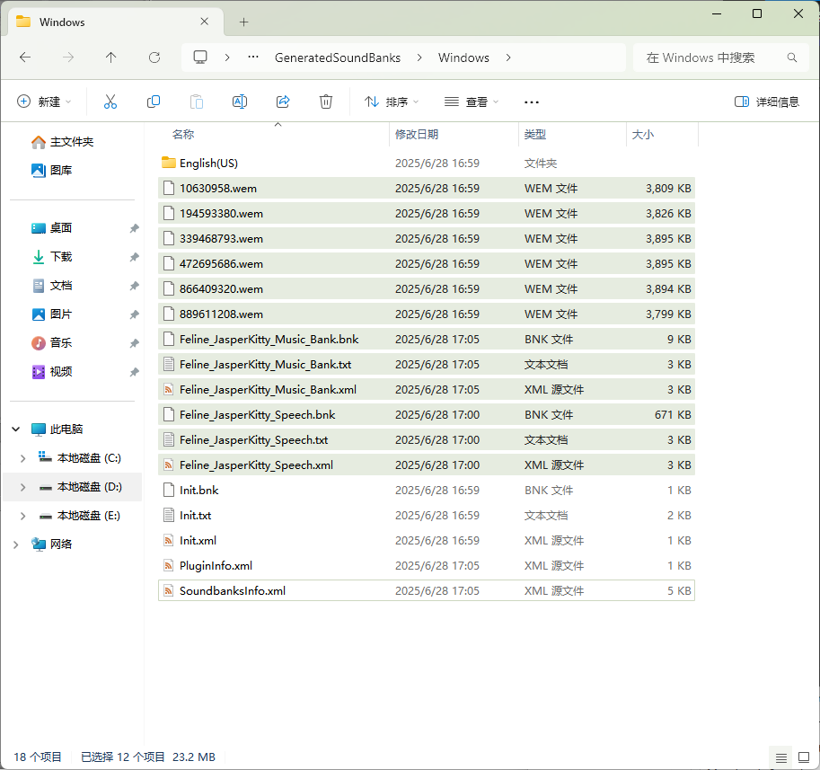

这些内容是有用的。

现在我们返回ModBuddy，建立Platforms\Windows\Audio文件夹，将这些文件全部导入。我们正需要ModBuddy在每次生成项目时帮我们把文件放入成品。

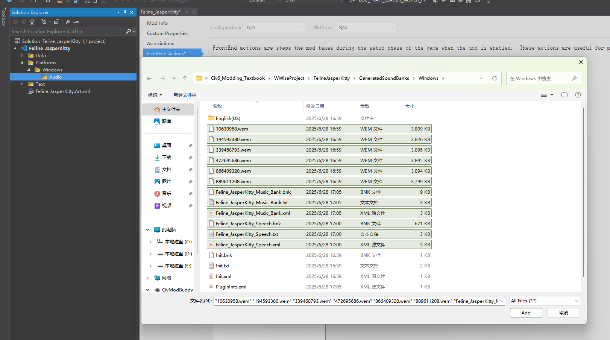

在同一个目录下新建一个名为项目代号+Banks.ini的文本文件（Text File）（本例中是Feline_JasperKitty_Banks.ini）填入以下内容：

```ini
;
; Sections are defined like so:
; Global = banks always resident
; Menu = banks loaded only during main menu
; InGame = banks loaded during gameplay, either 2D or 3D mode
; 2D = banks loaded only during 2D mode gameplay
; 3D = banks loaded only during 3D mode gameplay
; FMV = banks loaded only during the intro (and outro?) FMV
;

[Global]

[Menu]

[InGame]
Feline_JasperKitty_Music_Bank.bnk
Feline_JasperKitty_Speech.bnk


[2D]

[3D]

[FMV]

```

>**小心脚下**：也许会崩溃
>
>自行新建的ini文件可能会因为编码问题无法正常被游戏读取。可以先从别处，例如我们的示例工程中，复制一份再修改。

把所有的bnk文件名都放在InGame下，然后保存。

>**笔记笔记**：场合
>
>文明领袖音乐都放置在InGame环境下，其它音乐音效可能需要放在其他位置。拿不准主意时，可以放在Global（通用）一栏。

还记得怎么打开项目属性，配置前端动作和对局内动作吗？现在我们要调整最后一个对局内动作了——UpdateAudio。

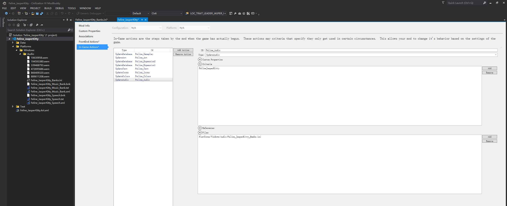

几乎要大功告成了。最后一步是配置领袖语音播放的动画时长。打开素材编辑器，用它打开你的领袖模型，然后在菜单栏选择“窗口”-“时间线编辑器”（Window-Timeline Editor）。将它的界面拖得大一些。

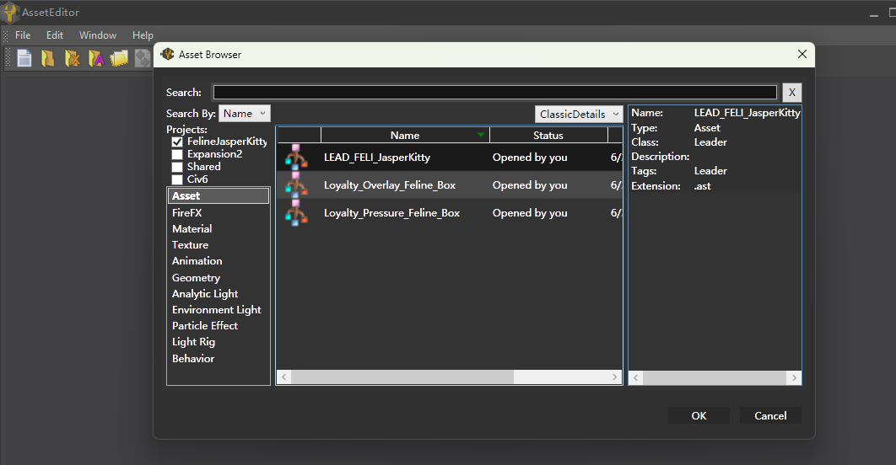

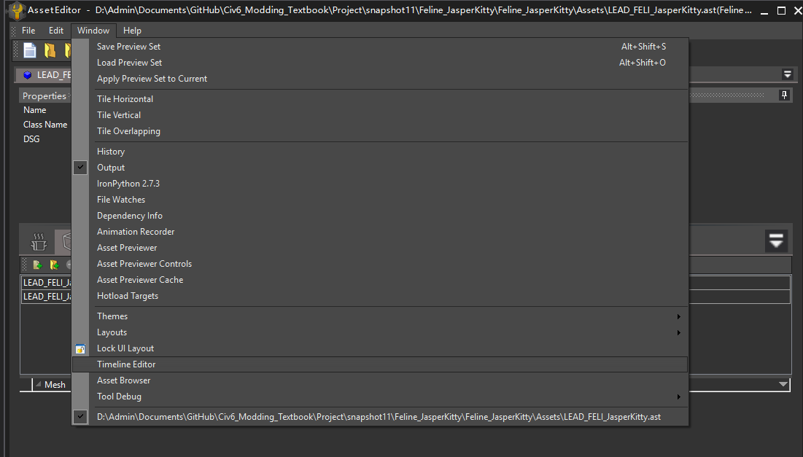

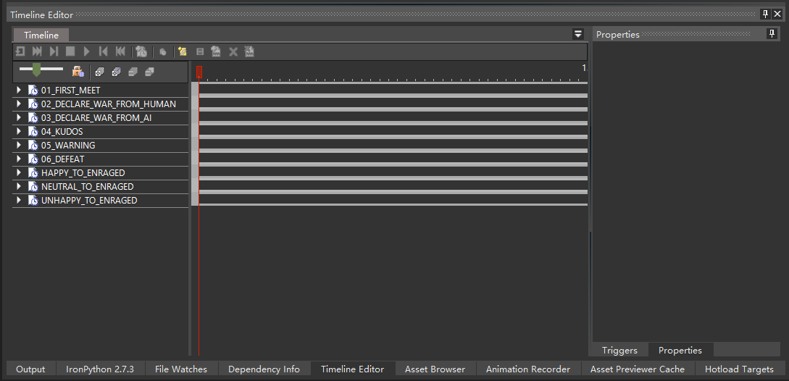

打开01到06的六段动画，会在Sound处看到一个绿点。点击这个绿点。

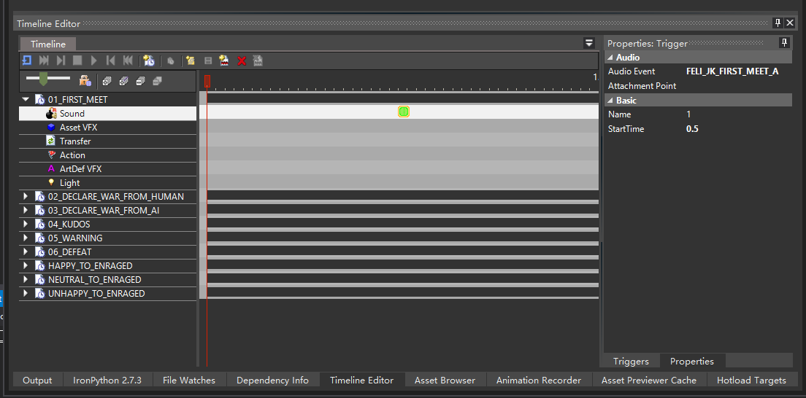

在右侧的面板中可以看到“音频事件”（Audio Event），填入你刚刚在WWise中填写的想播放的语音的事件名。

然后收起它们，点击动画本身。

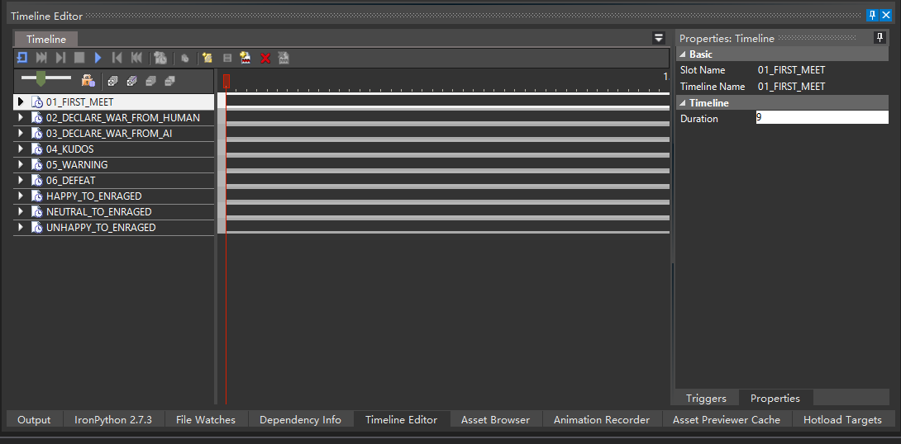

时长（Duration）决定了动画会停留多久。

将每一段动画时长改写为略长于语音时长（多半秒多些）的时间，保存。

生成你的模组吧——这次如果测试通过的话，你就完成了你的第一个领袖模组！祝贺！特别需要注意的是，一定要和笔者制作的可莉领袖以及你制作过的其它领袖一起进行测试，以确保没有出错——否则它们会相冲突，甚至导致游戏崩溃。

>**小道消息**：讲了个啥
>
>本模板工程中使用的角色语音来自《明日方舟》的薄绿。她是个喜欢读书的孩子，她的台词大意如下：
>
>初次见面：那个，我的代号是薄绿，你呢？
>
>被宣战：请不要妨碍我们！
>
>主动宣战：要不要看我变魔术？
>
>赞赏玩家：嘿嘿，如果这次能出结果，我就可以申请留校继续读书啦。
>
>敌视玩家：啊，不可以，不能随便乱碰我的书，它会咬你的手。
>
>战败：不行，危险......
>
>领袖语录：和喜欢的人待在一起，就会很开心。
>
>笔者充分利用了曾经打算推出的作品的素材资源。
